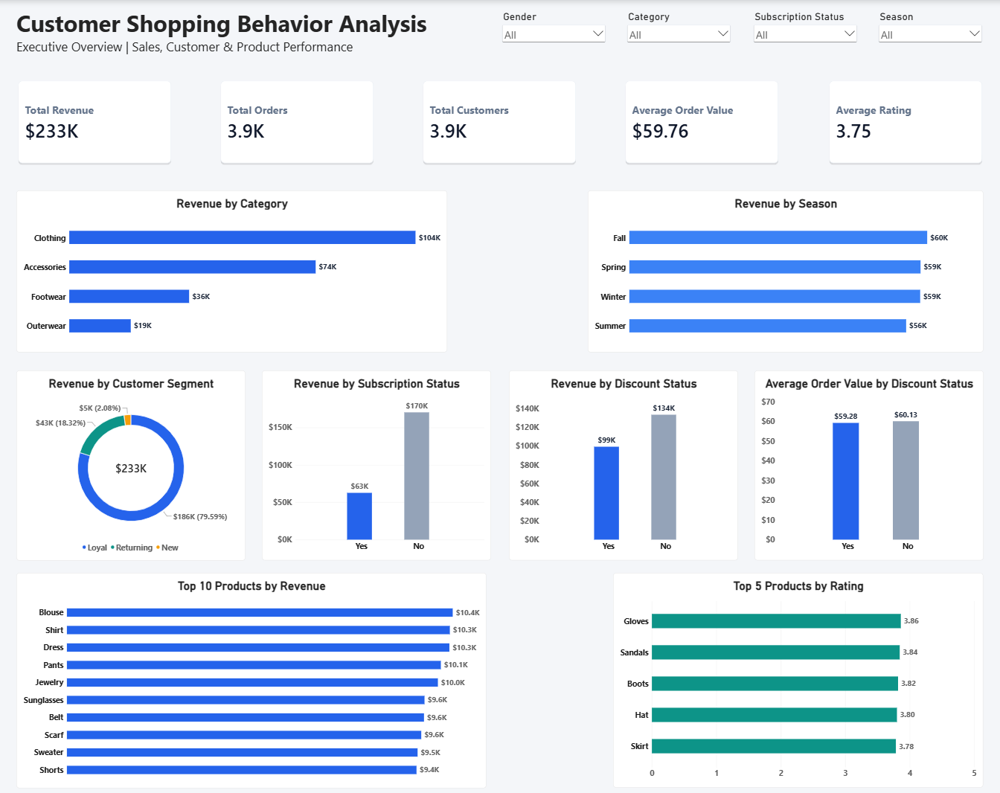
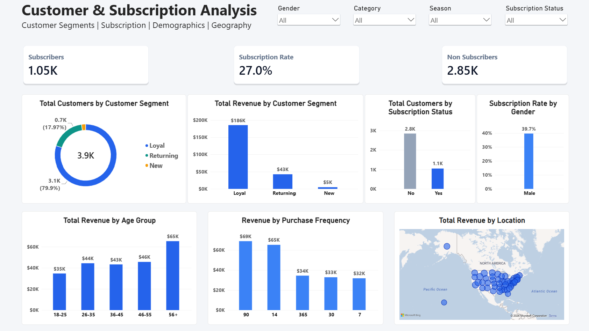

# Customer Shopping Behavior Analysis

## Project Overview

**Customer Shopping Behavior Analysis** is an end-to-end data analytics project that transforms raw customer purchase data into actionable business insights.

The project analyzes sales performance, customer segmentation, subscription behavior, discount usage, product performance, demographics, purchasing frequency, and seasonal trends using **Python, MySQL, SQL, and Power BI**.

The goal is to demonstrate a complete data analytics workflow — from data cleaning and database management to SQL analysis, dashboard development, and business recommendations.

---

## Business Objective

The primary objective of this project is to transform raw customer shopping data into actionable business insights.

The analysis focuses on:

- Understanding overall sales performance
- Identifying high-performing product categories and products
- Analyzing customer segments
- Evaluating subscription adoption
- Understanding discount usage
- Analyzing customer demographics
- Studying purchasing frequency
- Comparing seasonal performance
- Identifying repeat and loyal customers
- Understanding geographic revenue distribution

---

## Dataset

The dataset contains **3,900 customer purchase records** and includes information about:

- Customer demographics
- Purchased products
- Product categories
- Purchase amounts
- Locations
- Seasons
- Customer ratings
- Subscription status
- Shipping type
- Discount usage
- Previous purchases
- Payment methods
- Purchase frequency

### Key Dataset Fields

| Column | Description |
|---|---|
| customer_id | Unique customer identifier |
| age | Customer age |
| gender | Customer gender |
| item_purchased | Product purchased |
| category | Product category |
| purchase_amount_usd | Purchase amount in USD |
| location | Customer location |
| size | Product size |
| color | Product color |
| season | Purchase season |
| review_rating | Product/customer review rating |
| subscription_status | Subscription status |
| shipping_type | Shipping method |
| discount_applied | Whether discount was applied |
| previous_purchases | Number of previous purchases |
| payment_method | Payment method |
| frequency_of_purchases | Purchase frequency |
| age_group | Derived age group |
| purchase_frequency_days | Derived purchase frequency in days |

---

## Tools & Technologies

- **Python**
  - Pandas
  - NumPy
  - Matplotlib
  - Seaborn
  - SQLAlchemy
  - MySQL Connector

- **Database**
  - MySQL

- **Data Analysis**
  - SQL
  - CTEs
  - Window Functions
  - CASE statements
  - Aggregations

- **Visualization**
  - Power BI
  - DAX

- **Development**
  - VS Code
  - Git / GitHub

---

## Project Workflow

```text
Raw CSV
   ↓
Python / Pandas
   ↓
Data Cleaning & Transformation
   ↓
Cleaned CSV
   ↓
MySQL Database
   ↓
SQL Business Analysis
   ↓
Power BI
   ↓
Business Insights & Recommendations
```

## Data Cleaning & Transformation

Python was used to prepare the raw dataset before loading it into MySQL.

### Cleaning Steps

- Inspected dataset structure and data types
- Checked missing values
- Checked duplicate records
- Handled missing review ratings
- Standardized column names
- Created customer age groups
- Converted purchase frequency into numeric day intervals
- Checked redundant columns
- Removed the redundant `promo_code_used` field
- Performed final data validation


### Missing Review Ratings

The dataset contained missing values in Review Rating.

Missing ratings were imputed using the median review rating within each product category.

This approach preserves category-level rating characteristics rather than applying a single overall value.


## MySQL Database

The cleaned dataset was loaded into a MySQL database:

**Database:** `customer_shopping_analysis`

**Table:** `customer_shopping`

The final table contains:

- **3,900 records**
- **19 columns**

Data validation was performed after loading to verify:

Record count
Duplicate customer IDs
Missing values
Numeric ranges
Age groups
Purchase frequency values


## SQL Business Analysis

SQL was used to answer business questions related to:

1. Revenue by gender
2. High-spending customers using discounts
3. Top products by average rating
4. Shipping performance
5. Subscribers vs non-subscribers
6. Discount-dependent products
7. Customer segmentation
8. Top products by category
9. Repeat buyers and subscriptions
10. Revenue by age group
11. Overall business KPIs
12. Revenue by category
13. Discount vs non-discount performance
14. Revenue by season
15. Payment method performance
16. Subscription adoption by gender
17. Subscription rate by gender
18. Customer segment performance
19. Revenue by location
20. Top products by revenue
21. High purchase-history customers
22. Discount usage by category
23. Revenue by purchase frequency
24. Repeat buyers by age group
25. Category performance by subscription status


## Power BI Dashboard

The Power BI report contains two analytical pages.

### Page 1 — Executive Overview



The Executive Overview provides a high-level view of:

- Total Revenue
- Total Orders
- Total Customers
- Average Order Value
- Average Rating
- Revenue by Category
- Revenue by Season
- Revenue by Customer Segment
- Revenue by Subscription Status
- Discount Performance
- Top Products by Revenue
- Top Products by Rating

Interactive slicers allow analysis by:

- Gender
- Category
- Season
- Subscription Status

### Page 2 — Customer & Subscription Analysis



This page focuses on customer behavior and subscription performance.

It includes:

- Customer Segment Distribution
- Revenue by Customer Segment
- Customers by Subscription Status
- Subscription Rate by Gender
- Revenue by Age Group
- Revenue by Purchase Frequency
- Revenue by Location
- Total Subscribers
- Subscription Rate
- Non-Subscribers

Interactive filters include:

- Gender
- Category
- Season
- Subscription Status


## Customer Segmentation

Customers were segmented based on previous purchases.

| Segment | Definition |
|---|---|
| New | 1 previous purchase |
| Returning | 2–10 previous purchases |
| Loyal | More than 10 previous purchases |

This segmentation helps evaluate differences in revenue contribution and customer behavior.


## Key Business Insights

### 1. Clothing is the Primary Revenue Driver
Clothing contributes the largest share of overall revenue, making it the most important category for sales performance and inventory planning. Accessories provide the next strongest revenue contribution, while footwear and outerwear represent smaller but potentially focused growth opportunities.

### 2. Customer Retention Drives the Business
The analysis shows that customers with a strong purchase history contribute the majority of revenue. This indicates that customer retention and repeat purchasing are more significant to revenue generation than relying solely on new customer acquisition.

### 3. Subscription Adoption Represents a Growth Opportunity
A relatively small share of customers are subscribed, while the majority remain non-subscribers. Expanding subscription adoption could strengthen customer engagement and create additional opportunities for repeat purchases and long-term retention.

### 4. Discounts Do Not Clearly Increase Order Value
Discounted purchases account for a substantial portion of orders, but the average order value remains slightly lower than for non-discounted purchases. This suggests that discounts should be targeted strategically rather than applied broadly.

### 5. Seasonal Demand Shows a Clear Revenue Pattern
Fall generates the strongest revenue among the analyzed seasons, indicating an opportunity to align inventory, promotional campaigns, and product availability with seasonal demand patterns.

### 6. High Purchase-History Customers Are a Valuable Segment
A significant group of customers has a substantial history of previous purchases. These customers represent an important retention segment that can be targeted with loyalty benefits, personalized offers, and relevant product recommendations.

### 7. Product Performance Is Relatively Concentrated
A small group of products consistently appears among the highest revenue-generating items. These products can be prioritized for inventory availability, cross-selling, and promotional placement.


## Business Recommendations

### Subscription Growth

- Introduce stronger subscription benefits
- Offer exclusive subscriber promotions
- Consider shipping-related benefits
- Target eligible non-subscribers with personalized campaigns

### Customer Retention

- Develop loyalty rewards
- Create repeat-purchase campaigns
- Personalize offers based on purchase history
- Focus retention efforts on high purchase-history customers

### Discount Optimization

- Avoid relying on blanket discounts
- Use targeted promotions
- Consider minimum-spend offers
- Measure incremental revenue generated by promotions

### Product Strategy

- Continue monitoring high-revenue products
- Promote highly rated products
- Use cross-selling and recommendation strategies
- Monitor product performance by category

### Seasonal Planning

- Prepare inventory and campaigns ahead of Fall
- Analyze seasonal purchasing patterns
- Align promotions with seasonal demand

### Geographic Strategy

- Identify high-performing locations
- Use regional marketing campaigns
- Investigate opportunities in lower-performing locations


Important Analytical Considerations

This project is based on observational customer purchase data.

Therefore, relationships identified in the analysis should not automatically be interpreted as causal relationships.

For example:

A discount being associated with a particular purchase amount does not prove that the discount caused the purchase amount to increase or decrease.

Similarly, the subscription and repeat-purchase patterns should be interpreted within the context of this dataset.


Project Structure

Customer-Shopping-Behavior-Analysis/
│
├── data/
│   ├── customer_shopping_behavior.csv
│   └── customer_shopping_behavior_cleaned.csv
│
├── notebooks/
│
├── sql/
│   ├── 01_database_setup.sql
│   ├── 02_data_validation.sql
│   └── 03_business_analysis.sql
│
├── src/
│   ├── data_inspection.py
│   └── load_data_to_mysql.py
│
├── powerbi/
│   └── Customer_Shopping_Behavior_Analysis.pbix
│
├── README.md
│
└── requirements.txt


## Conclusion

This project demonstrates an end-to-end data analytics workflow starting from raw customer data and progressing through data cleaning, database management, SQL analysis, business intelligence, and visualization.

The analysis provides insights into sales performance, customer loyalty, subscription adoption, discount behavior, product performance, seasonal trends, demographics, and purchasing patterns.

The project demonstrates practical skills relevant to a Data Analyst role, including:
- Python data cleaning
- Pandas
- SQL
- MySQL
- Data validation
- Business analysis
- DAX
- Power BI
- Dashboard development
- Business insight generation
